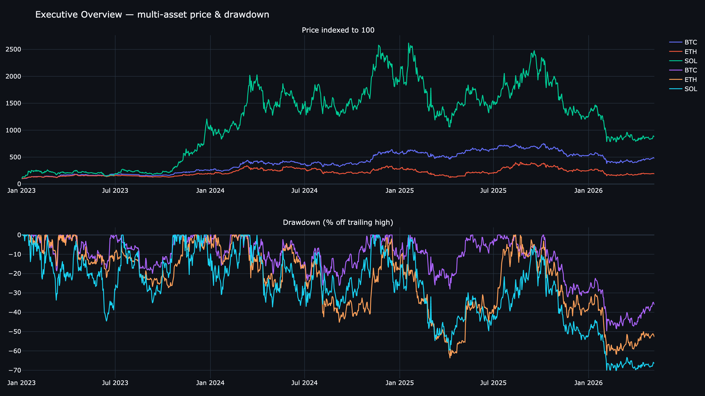
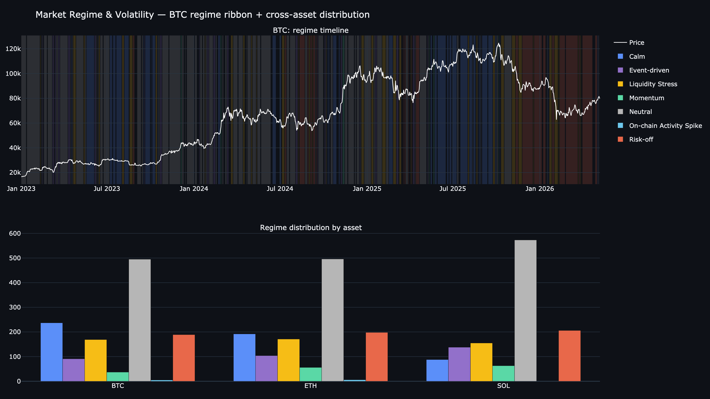
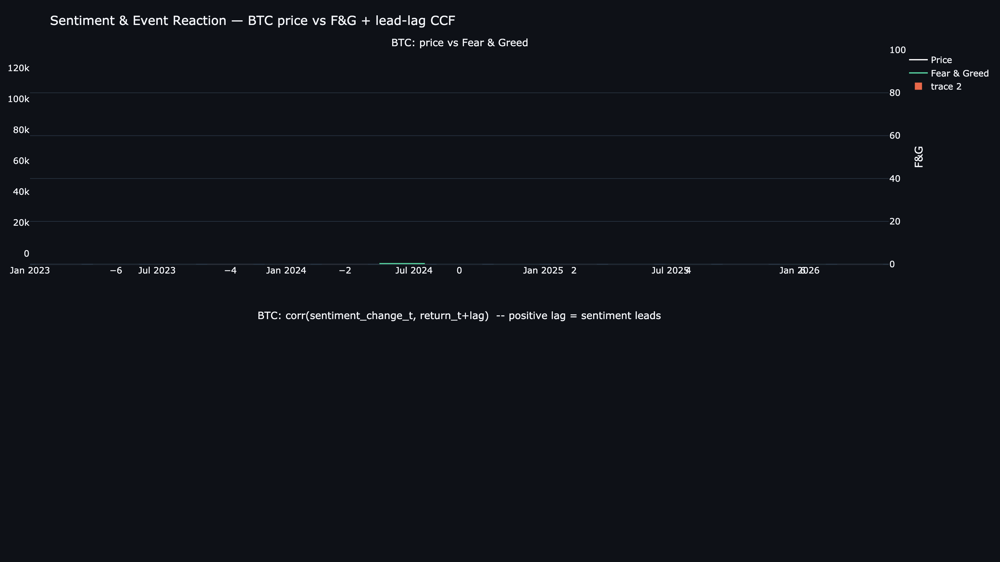
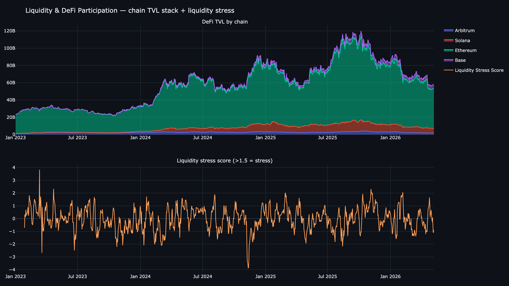
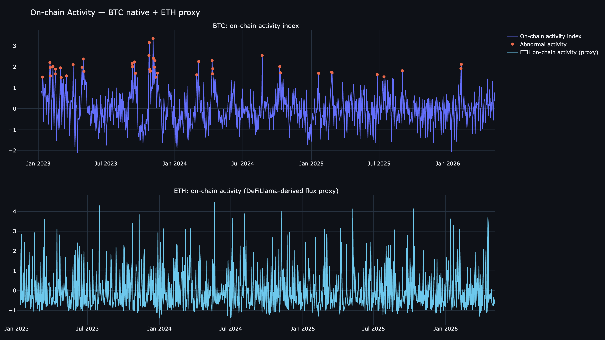
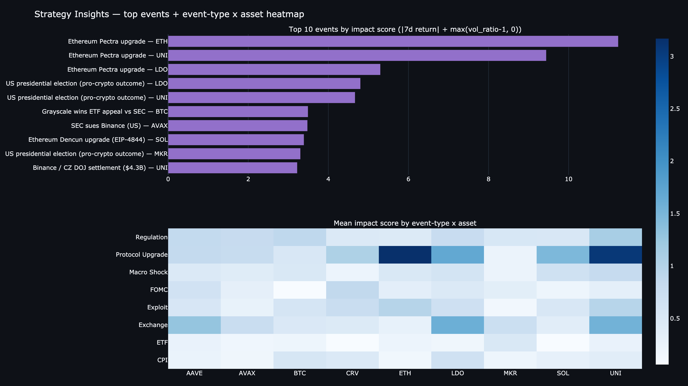
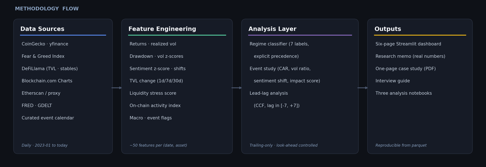

```mermaid
flowchart LR
  subgraph Ingest["Ingestion (src/ingest)"]
    M[CoinGecko + yfinance<br/>market_data.py]
    S[Alternative.me F&G<br/>sentiment_fng.py]
    D[DeFiLlama<br/>defi_llama.py]
    OB[Blockchain.com<br/>onchain_blockchain.py]
    OE[Etherscan + DeFiLlama proxy<br/>onchain_etherscan.py]
    MA[FRED + yfinance<br/>macro_fred.py]
    G[GDELT 2.0<br/>news_gdelt.py]
    E[Curated CSV<br/>events.py]
  end

  subgraph Features["Feature Engineering (src/features)"]
    MF[market_features]
    SF[sentiment_features]
    LF[liquidity_features]
    OF[onchain_features]
    MaF[macro_features]
    BF[build_features.py<br/>master join]
    RC[regime_classifier.py]
  end

  subgraph Analysis["Analysis (src/analysis)"]
    ES[event_study]
    LL[lead_lag]
    RConditional[regime_conditional]
    BS[behavior_summary]
  end

  subgraph Dashboard["Streamlit Dashboard (dashboard/)"]
    P1[Executive Overview]
    P2[Market Regime and Volatility]
    P3[Sentiment and Event Reaction]
    P4[Liquidity and DeFi]
    P5[On-chain Activity]
    P6[Strategy Insights]
  end

  Ingest --> Features --> Analysis --> Dashboard
  Features -.parquet.-> Dashboard
  Analysis -.parquet.-> Dashboard
```

# Digital Asset Market Behavior Intelligence Platform

*A multi-source research platform that explains how and why crypto markets move.*

[](https://github.com/bobaoxu2001/Digital-Asset-Market-Behavior-Intelligence-Platform/actions/workflows/ci.yml)
[](https://www.python.org/)
[](https://streamlit.io/)
[]()
[]()

---



A multi-source intelligence platform that fuses price, sentiment, liquidity and DeFi participation, on-chain activity, macro context, and curated events into interpretable behavior regimes, formal event studies, and strategy-relevant insights — the deliverables a digital-asset strategy team actually consumes.

## At a Glance

| Category | Details |
|---|---|
| Objective | Explain crypto market behavior, not predict next-day price |
| Coverage | BTC, ETH, SOL plus a six-token DeFi basket; daily; 2023-01-01 to present |
| Data Sources | yfinance, CoinGecko, Fear & Greed Index, DeFiLlama, Blockchain.com, Etherscan, FRED, GDELT, curated event calendar |
| Core Methods | Rule-based regime classification, event study, sentiment-price lead-lag, liquidity-stress composite, on-chain activity index |
| Main Outputs | Six-page Streamlit dashboard, research memo, one-page case study, three analysis notebooks |
| Key Finding | Fear & Greed lags price by approximately one day across all nine assets; event categories differ materially in short-window market reaction |

## Key Links

- **Live dashboard:** [crypto-market-behavior.streamlit.app](https://crypto-market-behavior.streamlit.app/)
  *(deployed on Streamlit Community Cloud; runs on bundled sample data with no API calls at runtime. Sample mode is signaled by a sidebar banner on every page.)*
- [Local Demo (run in <2 minutes)](#run-locally) and [Demo Mode (no API keys)](#demo-mode)
- [One-page case study (PDF)](reports/one_page_case_study.pdf) · [Markdown](reports/one_page_case_study.md)
- [Full research memo](reports/research_memo.md)
- [Interview guide](docs/interview_guide.md)
- [Deployment guide](docs/deployment_guide.md)

---

## Headline Findings

> **1. Sentiment lags price by approximately one day across all tracked assets.** Peak |corr| between daily change in Fear & Greed and asset return occurs at **lag = −1** for every asset in the sample (BTC +0.65, ETH +0.55, SOL +0.49). The implication is that Fear & Greed is best used as a confirming indicator, not as a forward-looking signal.

> **2. Event categories differ materially in short-window market reaction.** Mean event-impact ranking: Protocol Upgrade 1.44, Exchange 0.86, Regulation 0.74, Exploit 0.62, Macro Shock 0.51, FOMC 0.42, CPI 0.37, ETF 0.22. ETF and CPI events showed lower average short-window impact in this sample, likely because many were anticipated before the event date or close to consensus expectations. This does not mean those events are unimportant; it means the measured event-window surprise was smaller.

> **3. Regime labels carry economically meaningful information.** For BTC, *Momentum* and *Event-driven* days produced the bulk of upside in the sample; *Calm* days showed negative average performance; *Risk-off* and *Liquidity Stress* days were flat-to-negative. Regimes separate behavior — they are not noise.

> **4. The joint occurrence of liquidity stress and abnormal on-chain activity is a risk configuration to monitor or hedge.** Both signals coincided with the largest sample drawdowns (March 2023 SVB / USDC depeg week, August 2024 yen-carry unwind).

> Event-study results should be interpreted as short-window market reactions associated with event categories, not as strict causal estimates.

---

## Dashboard Overview

### Page 1 — Executive Overview
Multi-asset price (indexed to 100), drawdown panel, current-regime KPI cards, Fear & Greed score, DeFi TVL, liquidity stress score.


### Page 2 — Market Regime and Volatility
Regime ribbon overlaid on price, realized-volatility curves, regime distribution, regime-transition table.



### Page 3 — Sentiment and Event Reaction
Sentiment vs price (dual axis), curated-events overlay, lead-lag CCF, per-event reaction anatomy. The page includes a *Methodology note* expander explaining the lag interpretation.



### Page 4 — Liquidity and DeFi Participation
Chain-level TVL stack (Ethereum, Solana, Arbitrum, Base), top-protocol bars, stablecoin supply trend, liquidity-stress score with stress-zone shading.



### Page 5 — On-chain Activity
BTC native on-chain (Blockchain.com Charts) and ETH activity proxy (DeFiLlama-derived flux). The page includes a *Methodology note* expander documenting the Etherscan free-tier limitation. The hosted demo's bundled sample slice includes BTC and ETH on-chain coverage; if a hosted slice ever lacks meaningful on-chain rows, the page renders a clear professional fallback rather than blank charts.



### Page 6 — Strategy Insights
Top-ten most impactful events, event-type by asset heatmap, regime-conditional return distributions, and a structured *What happened / Why it matters / What to monitor next* panel. The page includes a *Methodology note* expander on the impact score and non-causal interpretation.



> Screenshots are reproducible from the same parquet outputs the live dashboard reads. Run `make screenshots` to regenerate them; run `make dashboard` for the interactive view.

---

## Methodology / Architecture





Data flow: raw JSON cached under `data/raw/<source>/`, cleaned parquet under `data/processed/`. The dashboard never calls APIs live — it reads parquet only. Every rolling feature is trailing-only and regime labels at time *t* use only features known by end of day *t*.

---

## Role Alignment

| Job description requirement | Module / output |
|---|---|
| Analyze price movements, volatility, and trading behavior across major digital assets | Market features and regime classifier (BTC, ETH, SOL plus DeFi basket) |
| Monitor sentiment, liquidity flows, and CEX / DeFi participation | Fear & Greed sentiment, DeFiLlama TVL, stablecoin supply, composite liquidity-stress score |
| Identify patterns in user behavior across exchanges, DeFi, and tokens | Per-chain TVL, protocol-level TVL, cross-asset event impact |
| Track on-chain wallet movements, transaction flows, and capital distribution | Blockchain.com (BTC) and Etherscan / DeFiLlama proxy (ETH) on-chain features |
| Support development of strategy insights | Strategy Insights dashboard page and research memo |
| Evaluate market reactions to news, events, and ecosystem developments | Curated 46-event calendar and formal event study |
| Prepare reports on market behavior, sentiment shifts, and emerging trends | Research memo and auto-generated insight panels in dashboard |
| Work independently in a remote research environment | Reproducible end-to-end pipeline: `make ingest && make features && make analysis && make dashboard` |

For interview-ready discussion of the project, see the [Interview Guide](docs/interview_guide.md).

---

## Run Locally

```bash
# 1. Set up environment (Python 3.11)
pip install -r requirements.txt

# 2. Configure API keys (optional — yfinance, DeFiLlama, and Blockchain.com require none)
cp .env.example .env
# Edit .env and fill in COINGECKO_API_KEY, ETHERSCAN_API_KEY, FRED_API_KEY if available.

# 3. Full pipeline (one to two minutes; cached after first run)
make ingest          # all sources, with graceful fallbacks
make features        # ~5 seconds
make analysis        # ~5 seconds
make test            # 7 sanity checks

# 4. Launch the dashboard
make dashboard       # Streamlit at http://localhost:8501
```

For deployment to Streamlit Community Cloud and operational notes, see the [Deployment Guide](docs/deployment_guide.md). The dashboard reads only from parquet at runtime, so it can deploy without giving the dashboard process outbound network access.

## Demo Mode

```bash
make demo
```

The bundled `data/sample/` directory contains small parquet files sufficient to render every dashboard page without running any ingestion. Use it for a quick walkthrough or a fresh-clone smoke test. No API keys and no network access are required.

The same logic powers the deployed app at [crypto-market-behavior.streamlit.app](https://crypto-market-behavior.streamlit.app/). On first request, `dashboard/app.py` calls `src/utils/demo_data.ensure_processed_data()`, which copies the bundled sample parquets into `data/processed/` and writes a `.sample_mode` marker file. Every page checks the marker and renders a sidebar banner ("Runtime mode: bundled sample data. No API calls are made at dashboard runtime.") so a viewer always knows what mode the app is in. Fresh data can be regenerated locally with `make ingest && make features && make analysis`.

---

## Project Structure

```
digital-asset-market-behavior-platform/
├── README.md
├── requirements.txt
├── Makefile                         # ingest / features / analysis / test / dashboard / demo / screenshots
├── .env.example                     # template; never commit .env
├── .gitignore
├── .github/workflows/ci.yml         # GitHub Actions: pytest, dashboard import smoke test, secret-scan guard
├── assets/
│   ├── methodology_flow.png         # methodology overview image
│   └── screenshots/                 # six dashboard previews (PNG)
├── config/config.yaml               # assets, chains, macro series, regime parameters
├── data/
│   ├── events_calendar.csv          # 46 curated events
│   ├── raw/                         # gitignored API cache
│   ├── processed/                   # gitignored parquet outputs
│   └── sample/                      # small sample parquets for demo mode
├── docs/
│   ├── deployment_guide.md          # Streamlit Cloud deployment and operations
│   └── interview_guide.md           # 30s/90s pitch, STAR answer, ten Q&A
├── notebooks/                       # supporting analysis notebooks
│   ├── 01_eda.ipynb                 # coverage, missingness, indexed price, vol, regime counts
│   ├── 02_event_study.ipynb         # impact by event type, top-10 events, type by asset heatmap
│   └── 03_lead_lag.ipynb            # sentiment-price CCF and interpretation
├── reports/
│   ├── research_memo.md             # full analyst memo
│   ├── one_page_case_study.md       # PDF-ready one-pager (markdown)
│   ├── one_page_case_study.pdf      # rendered PDF
│   └── findings_summary.md
├── memo/research_memo.md            # mirror of the memo
├── scripts/generate_screenshots.py  # rebuild dashboard previews from processed parquet
├── src/
│   ├── config.py
│   ├── ingest/                      # one module per source, all with fallbacks
│   ├── features/
│   └── analysis/
├── dashboard/
│   ├── app.py
│   ├── pages/
│   └── components/
└── tests/test_features.py
```

---

## Limitations

- **Etherscan free tier is Pro-locked** for `dailytx`, `dailyavggasprice`, and `dailynewaddress`. The platform falls back to a DeFiLlama-derived Ethereum chain-TVL flux as an activity proxy. Activity *direction* is informative; absolute units differ from native chain counters. A Pro Etherscan key would replace the proxy in `src/ingest/onchain_etherscan.py` without other code changes.
- **CoinGecko Demo plan** caps `market_chart/range` at 365 days. The platform uses yfinance for full history and CoinGecko for trailing-365-day enrichment of `market_cap`.
- **No exchange inflow / outflow.** Free sources do not reliably label exchange wallets. The platform deliberately avoids fabricating netflow; the more granular On-chain Accumulation / Distribution regime split is a documented upgrade path (Glassnode or CryptoQuant Pro).
- **Sentiment is a single proxy (Fear & Greed).** The lead-lag finding describes that proxy rather than sentiment in general. Tweet-level sentiment is no longer free since the X / Twitter API changes.
- **CryptoPanic news is explicitly out of scope** per project requirements. The curated event calendar provides the event channel.
- **Regime sample sizes** are small for *Momentum* and *Event-driven* in some assets; regime-conditional return statistics are illustrative of separation between regimes, not a tradable backtest.
- **Event-study interpretation.** Results should be read as short-window market reactions associated with event categories, not as strict causal estimates.

---

## Future Work

1. Funding-rate dispersion across major CEXs (Binance, OKX, Bybit) as a forward-looking liquidity-stress feature.
2. Deribit DVOL and 25-delta skew as an implied-volatility layer.
3. Glassnode or CryptoQuant Pro for native exchange netflow, splitting the *On-chain Activity Spike* regime into Accumulation and Distribution.
4. Probabilistic regime model (HMM or L1-logistic on transitions) seeded by the rule labels.
5. Hourly resolution for BTC and ETH event windows around scheduled macro releases.
6. Out-of-sample evaluation: train regime and lead-lag on 2023–2024, evaluate on 2025–2026, and report degradation.

---

## License and Credits

MIT. Built by Xu Ao for the WhatIf / What If Capital "Digital Asset Market Behavior & Strategy Analyst" application.

Data sources: CoinGecko, yfinance, Alternative.me, DeFiLlama, Blockchain.com Charts, Etherscan, FRED, GDELT 2.0. All within free-tier permissions.
