# Digital Asset Market Behavior Intelligence Platform

> **A multi-source intelligence platform that explains how and why crypto markets move — built for the analyst's job, not the predictor's.**

[](https://www.python.org/)
[](https://streamlit.io/)
[]()

This is not another crypto price-prediction project. It is a behavior-explanation platform that fuses **price**, **sentiment**, **liquidity / DeFi participation**, **on-chain activity**, **macro context**, and **events** into interpretable **regimes**, **event studies**, and **strategy insights** — exactly the deliverables a digital-asset strategy team consumes.

---

## Why this project matters

Most crypto portfolio projects predict next-day BTC price using Twitter sentiment. That is not the analyst's job. The analyst's job is to **explain market behavior**, **rank event sensitivities**, **detect regime shifts**, and **produce strategy-relevant insight**. This platform is structured around those deliverables end-to-end.

### Role alignment — Digital Asset Market Behavior & Strategy Analyst (WhatIf / What If Capital)

| Job requirement | Module |
|---|---|
| Analyze price movements, volatility, and trading behavior across major digital assets | Market features + regime classifier (BTC, ETH, SOL + DeFi basket) |
| Monitor sentiment, liquidity flows, and CEX/DeFi participation | Fear & Greed sentiment + DeFiLlama TVL + stablecoin supply + composite liquidity stress |
| Identify patterns in user behavior across exchanges, DeFi, and tokens | Per-chain TVL + protocol-level TVL + cross-asset event impact |
| Track on-chain wallet movements, transaction flows, capital distribution | Blockchain.com (BTC) + Etherscan/DeFiLlama proxy (ETH) on-chain features |
| Support development of strategy insights from behavioral trends | Strategy Insights dashboard page + research memo |
| Evaluate market reactions to news, events, and ecosystem developments | Curated 46-event calendar + formal event study (CAR, vol ratio, sentiment shift, TVL reaction) |
| Prepare reports on market behavior, sentiment shifts, emerging trends | Research memo (`reports/research_memo.md`) + auto-generated insight panels in dashboard |
| Work independently in a remote research environment | Reproducible end-to-end pipeline: `make ingest && make features && make analysis && make dashboard` |

---

## Key features

- 🎯 **9 assets covered:** BTC, ETH, SOL + DeFi basket (UNI, AAVE, LDO, MKR, CRV, AVAX) at daily resolution, 2023-01-01 to today.
- 🧠 **Interpretable regime classifier** with 7 transparent labels and explicit precedence rules (Event-driven → Liquidity Stress → Risk-off → On-chain Spike → Momentum → Calm → Neutral).
- 📅 **Curated 46-event calendar** spanning FOMC, CPI, ETF, Regulation, Exchange, Exploit, Protocol Upgrade, Macro Shock — plus a formal event-study output.
- 📈 **Lead-lag analysis** with a clean empirical finding: peak |corr| between F&G and price at **lag = −1 day for all 9 assets** — sentiment is reactive, not predictive.
- 💧 **Composite liquidity stress score** built from TVL trend + stablecoin trend, with a 1.5σ stress threshold.
- ⛓️ **On-chain activity index** for BTC (full Blockchain.com data) and ETH (DeFiLlama-derived flux proxy with documented limitations).
- 📊 **Polished 6-page Streamlit dashboard** with KPI cards, Plotly interactive charts, sidebar filters, and analyst-voice insight panels on every page.
- 📝 **Professional research memo** in `reports/research_memo.md` with real numbers from the analysis.
- 🛡️ **Graceful fallbacks everywhere.** Every API has a documented fallback path; the dashboard runs end-to-end even if individual sources fail.

---

## Architecture

```mermaid
flowchart LR
  subgraph Ingest["Ingestion (src/ingest)"]
    M[CoinGecko + yfinance<br/>market_data.py]
    S[Alternative.me F&G<br/>sentiment_fng.py]
    D[DeFiLlama<br/>defi_llama.py]
    OB[Blockchain.com<br/>onchain_blockchain.py]
    OE[Etherscan + DeFiLlama proxy<br/>onchain_etherscan.py]
    MA[FRED + yfinance<br/>macro_fred.py]
    G[GDELT 2.0<br/>news_gdelt.py]
    E[Curated CSV<br/>events.py]
  end

  subgraph Features["Feature Engineering (src/features)"]
    MF[market_features]
    SF[sentiment_features]
    LF[liquidity_features]
    OF[onchain_features]
    MaF[macro_features]
    BF[build_features.py<br/>master join]
    RC[regime_classifier.py]
  end

  subgraph Analysis["Analysis (src/analysis)"]
    ES[event_study]
    LL[lead_lag]
    RConditional[regime_conditional]
    BS[behavior_summary]
  end

  subgraph Dashboard["Streamlit Dashboard (dashboard/)"]
    P1[Executive Overview]
    P2[Market Regime & Volatility]
    P3[Sentiment & Event Reaction]
    P4[Liquidity & DeFi]
    P5[On-chain Activity]
    P6[Strategy Insights]
  end

  Ingest --> Features --> Analysis --> Dashboard
  Features -.parquet.-> Dashboard
  Analysis -.parquet.-> Dashboard
```



Data flows: raw JSON cached under `data/raw/<source>/`, cleaned parquet under `data/processed/`. The dashboard **never** calls APIs live — it reads parquet only.

---

## Example insights produced by the platform

> **Sentiment lags price by 1 day, universally.** Across all 9 tracked assets, peak |corr| between daily change in Fear & Greed and asset return is at lag = −1 (BTC: +0.65, ETH: +0.55, SOL: +0.49, …). Treat F&G as a confirmation tool, not a forecast.

> **Protocol upgrades and exchange incidents move markets more than ETF news.** Mean event-impact ranking: Protocol Upgrade 1.44 ▸ Exchange 0.86 ▸ Regulation 0.74 ▸ Exploit 0.62 ▸ Macro Shock 0.51 ▸ FOMC 0.42 ▸ CPI 0.37 ▸ ETF 0.22. ETF news ranks last because it was priced in over weeks.

> **Regime labels are economically meaningful.** For BTC, Calm days annualize negative (low-vol drift is not free return); Momentum and Event-driven days carry the upside; Risk-off and Liquidity Stress are flat-to-negative.

> **Liquidity stress + abnormal on-chain activity = the configuration to fade.** Both signals coincided with the worst drawdowns in the sample (March 2023 banking crisis, August 2024 yen-carry unwind).

---

## Run locally

```bash
# 1. Set up environment (Python 3.11 recommended)
pip install -r requirements.txt

# 2. Configure API keys
cp .env.example .env
# Edit .env and fill in COINGECKO_API_KEY, ETHERSCAN_API_KEY, FRED_API_KEY
# (CRYPTOPANIC_API_KEY is optional and can stay blank)

# 3. Run the full pipeline
make ingest      # ~1-2 minutes; cached after first run
make features    # ~5 seconds
make analysis    # ~5 seconds
make test        # run sanity tests

# 4. Launch the dashboard
make dashboard   # opens Streamlit on http://localhost:8501
```

If any individual API fails, ingestion logs the failure and the pipeline continues with documented fallbacks. The dashboard always renders end-to-end on the data you have.

---

## Project structure

```
digital-asset-market-behavior-platform/
├── README.md
├── requirements.txt
├── Makefile
├── .env.example                  # template; never commit .env
├── .gitignore
├── config/config.yaml            # assets, chains, macro series, regime params
├── data/
│   ├── events_calendar.csv       # 46 curated events
│   ├── raw/                      # gitignored cached JSON
│   ├── processed/                # gitignored parquet outputs
│   └── sample/                   # small sample for the README screenshots
├── src/
│   ├── config.py                 # central loader; reads .env
│   ├── ingest/                   # one module per data source
│   │   ├── market_data.py        # yfinance + CoinGecko
│   │   ├── sentiment_fng.py      # alternative.me Fear & Greed
│   │   ├── defi_llama.py         # chain TVL, protocol TVL, stablecoins
│   │   ├── onchain_blockchain.py # BTC on-chain
│   │   ├── onchain_etherscan.py  # ETH on-chain (Pro fallback)
│   │   ├── macro_fred.py         # FRED + yfinance fallback
│   │   ├── news_gdelt.py         # optional
│   │   └── events.py             # curated CSV loader
│   ├── features/                 # feature engineering
│   │   ├── market_features.py
│   │   ├── sentiment_features.py
│   │   ├── liquidity_features.py
│   │   ├── onchain_features.py
│   │   ├── macro_features.py
│   │   ├── regime_classifier.py
│   │   └── build_features.py     # master join → features.parquet
│   ├── analysis/
│   │   ├── event_study.py
│   │   ├── lead_lag.py
│   │   ├── regime_conditional.py
│   │   └── behavior_summary.py
│   └── utils/                    # logging, caching, IO
├── dashboard/
│   ├── app.py                    # Streamlit entry
│   ├── pages/                    # 6 dashboard pages
│   └── components/               # charts, KPIs, insight templates
├── reports/
│   ├── research_memo.md
│   └── findings_summary.md
├── memo/research_memo.md
├── notebooks/                    # 01_eda, 02_event_study, 03_lead_lag (placeholders)
└── tests/test_features.py
```

---

## Event severity rubric

The curated event calendar uses a 1–3 severity score:

- **1** — low/moderate relevance (a routine FOMC pause, a CPI in line)
- **2** — meaningful market relevance (an unexpected SEC enforcement, a notable CPI miss)
- **3** — major market-moving event (FTX collapse, ETF approval, Bybit hack, macro shocks)

Severity is used only for tie-breaking when multiple events share a date. The composite event-impact score does **not** weight by severity, so any sensitivity from severity choice is bounded.

---

## Limitations

- **Etherscan free tier is Pro-locked** for `dailytx`, `dailyavggasprice`, `dailynewaddress`. The platform falls back to a DeFiLlama-derived Ethereum chain-TVL flux as an activity proxy. The activity *direction* is informative; absolute units differ from native tx counters. A Pro Etherscan key would replace this in `src/ingest/onchain_etherscan.py` without other code changes.
- **CoinGecko Demo plan** caps `market_chart/range` at 365 days of history. The platform uses yfinance for full history and CoinGecko for trailing-365d enrichment of `market_cap`.
- **No exchange inflow/outflow.** Free sources do not reliably label exchange wallets. The platform deliberately avoids fabricating netflow; the more granular "On-chain Accumulation / Distribution" regime split is a documented upgrade path (Glassnode / CryptoQuant Pro).
- **Sentiment is a single proxy (Fear & Greed).** It is the cleanest free daily series; tweet-level sentiment is no longer free since X/Twitter API changes. Lead-lag findings refer to the available sentiment proxy, not sentiment in general.
- **CryptoPanic news is not included** — explicitly out of scope per project requirements; the curated event calendar provides the event channel.

---

## Future work

1. Funding-rate dispersion across CEXs as a forward-looking liquidity stress feature.
2. Deribit DVOL and 25-delta skew for an implied-vol layer.
3. Glassnode/CryptoQuant Pro for native exchange netflow → splits the *On-chain Activity Spike* regime into Accumulation vs Distribution.
4. Probabilistic regime model (HMM or L1-logistic) seeded by the rule labels.
5. Hourly resolution for BTC/ETH event windows around scheduled macro releases.
6. Out-of-sample evaluation (train 2023–2024, eval 2025–2026) of the strategy implications.

---

## Interview talking points

**90-second pitch:**
> I built a Digital Asset Market Behavior Intelligence Platform that explains, rather than predicts, how crypto markets move. It pulls daily data from CoinGecko + yfinance for prices, alternative.me for Fear & Greed sentiment, DeFiLlama for chain-level TVL and stablecoins, Blockchain.com for BTC on-chain, Etherscan for ETH on-chain (with a documented free-tier proxy), FRED for macro, plus a curated calendar of 46 macro and crypto events. From those, I engineered ~50 features, ran a rule-based classifier into 7 interpretable regimes, executed a formal event study, and analyzed sentiment-price lead-lag. Three findings stood out: sentiment lags price by 1 day across all 9 assets — F&G is reactive, not predictive; protocol-upgrade and exchange events generate the largest reactions while ETFs and CPI prints are mostly priced in; and regime labels carry real economic information about subsequent returns. The output is a 6-page Streamlit dashboard plus a written research memo with strategy implications.

**Likely questions and answers:**

1. *Why not a price-prediction model?* — Because the role is behavior and strategy research. A price model on free daily data without microstructure would either overfit or be mediocre. Regimes and event studies are interpretable and consumable.
2. *Why rule-based regimes instead of an HMM?* — Auditability. With ~1200 daily obs and 7 regimes, an HMM is fragile and the labels aren't stable across re-fits. Rules are defensible and a portfolio manager can disagree with a threshold. The framework supports swapping in a probabilistic model seeded with rule labels.
3. *How do you avoid look-ahead bias?* — All rolling features are trailing-only. Regime labels at time t use only features known by end of day t. Event-study windows are computed in calendar time, never re-baselined.
4. *Etherscan didn't work — how confident are you in the ETH on-chain story?* — Modestly. The fallback proxy captures direction; absolute units are not native tx-counts. I document this in the dashboard and memo. A Pro Etherscan key replaces the proxy with native counters in one module.
5. *What would you add with two more weeks?* — Funding-rate dispersion, Deribit DVOL, native exchange netflow via Glassnode, and out-of-sample evaluation of the regime/event findings.

---

*Built by Xu Ao — for the WhatIf / What If Capital "Digital Asset Market Behavior & Strategy Analyst" application.*
