# Digital Asset Market Behavior Intelligence Platform

*A multi-source research platform that explains how and why crypto markets move.*

[](https://github.com/bobaoxu2001/Digital-Asset-Market-Behavior-Intelligence-Platform/actions/workflows/ci.yml)
[](https://www.python.org/)
[](https://streamlit.io/)
[]()
[]()

---


> A multi-source intelligence platform that fuses price, sentiment, liquidity and DeFi participation, on-chain activity, macro context, and curated events into interpretable behavior regimes, formal event studies, and strategy-relevant insights — the deliverables a digital-asset strategy team consumes.

**One-page case study:** [`reports/one_page_case_study.md`](reports/one_page_case_study.md)
**Full research memo:** [`reports/research_memo.md`](reports/research_memo.md)

---

## Live Demo

The dashboard runs locally in under two minutes from a fresh clone (see [Run Locally](#run-locally)). It is also designed to deploy to Streamlit Community Cloud with no code changes — point the deployment at `dashboard/app.py` and add the API keys as Streamlit secrets.

> *Streamlit Cloud deployment slot reserved — link will be added here.*

In the meantime, screenshots of all six dashboard pages appear below, and `make demo` runs the full dashboard from the small bundled sample data without touching any API.

---

## Why This Is Not Another Crypto Price-Prediction Project

For a strategy analyst, the core task is not next-day price prediction; it is explaining market behavior, ranking event sensitivity, and communicating risk-relevant insights. Specifically:

- explain *market behavior* — why did volatility rise, why did the regime shift?
- rank *event sensitivities* — which catalysts move markets, which were already discounted?
- detect *regime transitions* — Calm, Momentum, Risk-off, Liquidity Stress, Event-driven?
- produce *strategy-relevant insight* — written, defensible, falsifiable.

The platform is structured around those deliverables end-to-end. It deliberately does not ship a price-prediction model. Instead, it ships:

| Output | Description | Location |
|---|---|---|
| Six-page Streamlit dashboard | Interactive Plotly visualizations, dark theme, KPI cards | [`dashboard/`](dashboard/) |
| Research memo | Analyst-style write-up with real numbers from the analysis | [`reports/research_memo.md`](reports/research_memo.md) |
| One-page case study | Recruiter-facing summary, PDF-ready | [`reports/one_page_case_study.md`](reports/one_page_case_study.md) |
| Rule-based regime classifier | Seven transparent labels with explicit precedence | [`src/features/regime_classifier.py`](src/features/regime_classifier.py) |
| Curated 46-event calendar and event study | CAR, vol ratio, sentiment shift, TVL reaction | [`data/events_calendar.csv`](data/events_calendar.csv), [`src/analysis/event_study.py`](src/analysis/event_study.py) |
| Lead-lag analysis | Cross-correlation across `lag ∈ [-7, +7]` | [`src/analysis/lead_lag.py`](src/analysis/lead_lag.py) |
| Composite liquidity stress score | TVL trend and stablecoin trend, 1.5σ threshold | [`src/features/liquidity_features.py`](src/features/liquidity_features.py) |
| On-chain activity index | Transaction count, addresses, fees — z-scored composite | [`src/features/onchain_features.py`](src/features/onchain_features.py) |

---

## Headline Findings

> **1. Sentiment lags price by approximately one day across all tracked assets.** Peak |corr| between daily change in Fear & Greed and asset return occurs at **lag = −1** for every asset in the sample (BTC +0.65, ETH +0.55, SOL +0.49). The implication is that Fear & Greed is best used as a confirming indicator, not as a forward-looking signal.

> **2. Protocol upgrades and exchange-related events are associated with larger short-window reactions than ETF or CPI events.** Mean event-impact ranking: Protocol Upgrade 1.44, Exchange 0.86, Regulation 0.74, Exploit 0.62, Macro Shock 0.51, FOMC 0.42, CPI 0.37, ETF 0.22. ETF events show lower average short-window impact, likely because major approval expectations were partially priced in before the event date.

> **3. Regime labels carry economically meaningful information.** For BTC, *Momentum* and *Event-driven* days produced the bulk of upside in the sample; *Calm* days showed negative average performance; *Risk-off* and *Liquidity Stress* days were flat-to-negative. Regimes separate behavior — they are not noise.

> **4. The joint occurrence of liquidity stress and abnormal on-chain activity is a risk configuration to monitor or hedge.** Both signals coincided with the largest sample drawdowns (March 2023 SVB / USDC depeg week, August 2024 yen-carry unwind).

---

## Dashboard Overview

### Page 1 — Executive Overview
Multi-asset price (indexed to 100), drawdown panel, current-regime KPI cards, Fear & Greed score, DeFi TVL, liquidity stress score.


### Page 2 — Market Regime and Volatility
Regime ribbon overlaid on price, realized-volatility curves, regime distribution, and a regime-transition table.


### Page 3 — Sentiment and Event Reaction
Sentiment vs price (dual axis), curated-events overlay, lead-lag CCF chart, per-event reaction anatomy.


### Page 4 — Liquidity and DeFi Participation
Chain-level TVL stack (Ethereum, Solana, Arbitrum, Base), top-protocol bars, stablecoin supply trend, liquidity stress score with stress-zone shading.


### Page 5 — On-chain Activity
BTC native on-chain (Blockchain.com Charts) and ETH activity proxy (DeFiLlama-derived flux, with explicit disclaimer about Etherscan free-tier limitations).


### Page 6 — Strategy Insights
Top-ten most impactful events, event-type by asset heatmap, regime-conditional return distributions, and a structured *What happened / Why it matters / What to monitor next* panel.


> Screenshots above are auto-generated previews built directly from the processed parquet data (`scripts/generate_screenshots.py`). For pixel-perfect captures of the live Streamlit dashboard, run `make dashboard` and screen-capture each page.

---

## How a Strategy Analyst Would Use This

1. Open the **Executive Overview** to see at a glance the current regime for each major asset and whether the liquidity-stress score is elevated.
2. Drill into **Market Regime and Volatility** to confirm whether the current regime is persistent or transitioning, and inspect the regime-transition matrix.
3. Use the **Sentiment and Event Reaction** page before publishing a market note: *was the move organic, or was today's CPI / ETF flow / exchange announcement the proximate driver?* Inspect the relevant event window.
4. Check **Liquidity and DeFi Participation** to confirm whether DeFi capital is rotating in or out — an early signal for risk-on / risk-off rotations.
5. Use the **Strategy Insights** page to draft the actual memo: which event type the team is most exposed to, which assets amplify those reactions, and what the on-chain configuration is implying.

---

## Architecture

```mermaid
flowchart LR
  subgraph Ingest["Ingestion (src/ingest)"]
    M[CoinGecko + yfinance<br/>market_data.py]
    S[Alternative.me F&G<br/>sentiment_fng.py]
    D[DeFiLlama<br/>defi_llama.py]
    OB[Blockchain.com<br/>onchain_blockchain.py]
    OE[Etherscan + DeFiLlama proxy<br/>onchain_etherscan.py]
    MA[FRED + yfinance<br/>macro_fred.py]
    G[GDELT 2.0<br/>news_gdelt.py]
    E[Curated CSV<br/>events.py]
  end

  subgraph Features["Feature Engineering (src/features)"]
    MF[market_features]
    SF[sentiment_features]
    LF[liquidity_features]
    OF[onchain_features]
    MaF[macro_features]
    BF[build_features.py<br/>master join]
    RC[regime_classifier.py]
  end

  subgraph Analysis["Analysis (src/analysis)"]
    ES[event_study]
    LL[lead_lag]
    RConditional[regime_conditional]
    BS[behavior_summary]
  end

  subgraph Dashboard["Streamlit Dashboard (dashboard/)"]
    P1[Executive Overview]
    P2[Market Regime and Volatility]
    P3[Sentiment and Event Reaction]
    P4[Liquidity and DeFi]
    P5[On-chain Activity]
    P6[Strategy Insights]
  end

  Ingest --> Features --> Analysis --> Dashboard
  Features -.parquet.-> Dashboard
  Analysis -.parquet.-> Dashboard
```



Data flow: raw JSON cached under `data/raw/<source>/`, cleaned parquet under `data/processed/`. The dashboard never calls APIs live — it reads parquet only.

---

## Role Alignment

| Job description requirement | Module / output |
|---|---|
| Analyze price movements, volatility, and trading behavior across major digital assets | Market features and regime classifier (BTC, ETH, SOL plus DeFi basket) |
| Monitor sentiment, liquidity flows, and CEX / DeFi participation | Fear & Greed sentiment, DeFiLlama TVL, stablecoin supply, composite liquidity-stress score |
| Identify patterns in user behavior across exchanges, DeFi, and tokens | Per-chain TVL, protocol-level TVL, cross-asset event impact |
| Track on-chain wallet movements, transaction flows, and capital distribution | Blockchain.com (BTC) and Etherscan / DeFiLlama proxy (ETH) on-chain features |
| Support development of strategy insights | Strategy Insights dashboard page and research memo |
| Evaluate market reactions to news, events, and ecosystem developments | Curated 46-event calendar and formal event study |
| Prepare reports on market behavior, sentiment shifts, and emerging trends | Research memo and auto-generated insight panels in dashboard |
| Work independently in a remote research environment | Reproducible end-to-end pipeline: `make ingest && make features && make analysis && make dashboard` |

---

## Interview Summary

> The Digital Asset Market Behavior Intelligence Platform is a research tool that explains, rather than predicts, how crypto markets move. It pulls daily data from CoinGecko and yfinance for prices, alternative.me for Fear & Greed, DeFiLlama for chain TVL and stablecoins, Blockchain.com for BTC on-chain, an Etherscan-or-DeFiLlama-proxy for ETH on-chain, FRED for macro, plus a curated calendar of 46 macro and crypto events. From those, I engineer about fifty features, classify each day into one of seven interpretable regimes via explicit rules, run a formal event study, and analyze sentiment-price lead-lag.
>
> Three findings stood out. First, sentiment lags price by approximately one day across all nine tracked assets, so Fear & Greed is best treated as a confirming indicator. Second, protocol upgrades and exchange events are associated with the largest short-window reactions; ETF and CPI events show lower average impact, consistent with substantial pre-event pricing. Third, regime labels carry economically meaningful information about subsequent realized returns.
>
> The deliverables are a six-page Streamlit dashboard and a written research memo with strategy implications. Every method is interpretable, every API has a documented fallback, and the dashboard runs end-to-end from parquet without ever calling an API live.

---

## Run Locally

```bash
# 1. Set up environment (Python 3.11)
pip install -r requirements.txt

# 2. Configure API keys (optional — yfinance, DeFiLlama, and Blockchain.com require none)
cp .env.example .env
# Edit .env and fill in COINGECKO_API_KEY, ETHERSCAN_API_KEY, FRED_API_KEY if available.

# 3. Full pipeline (one to two minutes; cached after first run)
make ingest          # all sources, with graceful fallbacks
make features        # ~5 seconds
make analysis        # ~5 seconds
make test            # 7 sanity checks

# 4. Launch the dashboard
make dashboard       # opens Streamlit at http://localhost:8501
```

### Demo Mode

```bash
make demo            # copies bundled sample parquet to data/processed/, then launches dashboard
```

The bundled `data/sample/` directory contains small parquet files sufficient to render every dashboard page without running any ingestion. Use this for a quick demo or for CI smoke tests.

---

## Project Structure

```
digital-asset-market-behavior-platform/
├── README.md                        # this file
├── requirements.txt
├── Makefile                         # ingest / features / analysis / test / dashboard / demo / screenshots
├── .env.example                     # template; never commit .env
├── .gitignore
├── .github/workflows/ci.yml         # GitHub Actions: pytest and dashboard smoke test on Python 3.11
├── assets/screenshots/              # Six dashboard previews (PNG, 3200x1800)
├── config/config.yaml               # Assets, chains, macro series, regime parameters
├── data/
│   ├── events_calendar.csv          # 46 curated events (FOMC, CPI, ETF, Reg, Exchange, Exploit, Upgrade, Macro)
│   ├── raw/                         # gitignored cached JSON
│   ├── processed/                   # gitignored full parquet outputs
│   └── sample/                      # small sample parquets bundled for demo mode
├── scripts/
│   └── generate_screenshots.py      # rebuild dashboard previews from processed parquet
├── src/
│   ├── config.py                    # central loader; reads .env
│   ├── ingest/                      # one module per data source, all with fallbacks
│   ├── features/                    # market, sentiment, liquidity, on-chain, macro, regime
│   └── analysis/                    # event_study, lead_lag, regime_conditional, behavior_summary
├── dashboard/
│   ├── app.py                       # Streamlit entry
│   ├── pages/                       # 6 dashboard pages (Streamlit auto-routes)
│   └── components/                  # charts, KPIs, insight templates
├── reports/
│   ├── research_memo.md             # full analyst memo
│   ├── one_page_case_study.md       # PDF-ready 1-pager
│   └── findings_summary.md
├── memo/research_memo.md            # mirror of the memo (per blueprint structure)
├── notebooks/                       # 01_eda, 02_event_study, 03_lead_lag (placeholders)
└── tests/test_features.py           # 7 sanity tests
```

---

## Event Severity Rubric

The curated event calendar uses a 1–3 severity score:

- **1** — low to moderate relevance (a routine FOMC pause, a CPI in line with consensus)
- **2** — meaningful market relevance (an unexpected SEC enforcement action, a notable CPI miss)
- **3** — major market-moving event (FTX collapse, ETF approval, Bybit hack, macro shocks)

Severity is used only for tie-breaking when multiple events share a date. The composite event-impact score does not weight by severity, so any sensitivity from severity choice is bounded.

---

## Limitations

- **Etherscan free tier is Pro-locked** for `dailytx`, `dailyavggasprice`, and `dailynewaddress`. The platform falls back to a DeFiLlama-derived Ethereum chain-TVL flux as an activity proxy. Activity *direction* is informative; absolute units differ from native chain counters. A Pro Etherscan key would replace the proxy in `src/ingest/onchain_etherscan.py` without other code changes.
- **CoinGecko Demo plan** caps `market_chart/range` at 365 days. The platform uses yfinance for full history and CoinGecko for trailing-365-day enrichment of `market_cap`.
- **No exchange inflow / outflow.** Free sources do not reliably label exchange wallets. The platform deliberately avoids fabricating netflow; the more granular On-chain Accumulation / Distribution regime split is a documented upgrade path (Glassnode or CryptoQuant Pro).
- **Sentiment is a single proxy (Fear & Greed).** It is the cleanest free daily series; tweet-level sentiment is no longer free since the X / Twitter API changes. Lead-lag findings refer to the available sentiment proxy, not sentiment in general.
- **CryptoPanic news is explicitly out of scope** per project requirements. The curated event calendar provides the event channel.
- **Regime sample sizes** are small for *Momentum* and *Event-driven* in some assets; regime-conditional annualized returns are illustrative of separation between regimes, not a tradable backtest.

---

## Future Work

1. Funding-rate dispersion across major CEXs (Binance, OKX, Bybit) as a forward-looking liquidity-stress feature.
2. Deribit DVOL and 25-delta skew as an implied-volatility layer.
3. Glassnode or CryptoQuant Pro for native exchange netflow, splitting the *On-chain Activity Spike* regime into Accumulation and Distribution.
4. Probabilistic regime model (HMM or L1-logistic on transitions) seeded by the rule labels.
5. Hourly resolution for BTC and ETH event windows around scheduled macro releases.
6. Out-of-sample evaluation: train regime and lead-lag on 2023–2024, evaluate on 2025–2026, and report degradation.

---

## License and Credits

MIT. Built by Xu Ao for the WhatIf / What If Capital "Digital Asset Market Behavior & Strategy Analyst" application.

Data sources: CoinGecko, yfinance, Alternative.me, DeFiLlama, Blockchain.com Charts, Etherscan, FRED, GDELT 2.0. All within free-tier permissions.
